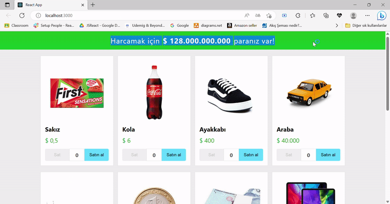

<h1>MONEY SPENDING APP</h1>
 

 Money spending application that I made with the api I created using the useState hook from React hooks 

 
<h3>Used Techs</h3>
<h5>HTML5, CSS3, JAVASCRİPT, REACT , JSON API</h5>
 
<h2>Screen</h2>

